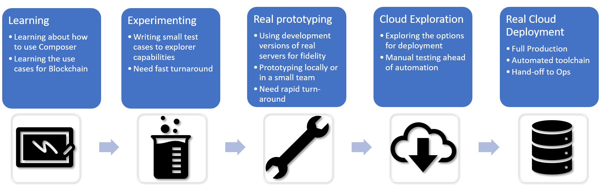
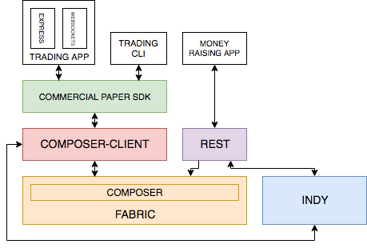

# Development Flow

This repo is designed to provide an example of using blockchain tech, within a larger stack application. Centred around the provision of a Commerical Paper trading scenario.

We're focussing on the "Real Prototyping", and "Cloud Exploration" and starting on the road to "Real Cloud Deployment".  

*End goals are:*

- See how "Real Prototyping" will work using the local develoment versions of the servers. And how you can roundtrip the development flow
- See how the skills and tools used will migrate to allow "Cloud Exploration" of the IBM Blockchain Starter Plan
- See how the scripts used to deploy all the components within this repo could be used as the basis for "Real Cloud Deployment"

Teaching details about the basics of Hyperledger Composer, Fabric or Indy is not the goal. This is all contained with a single repository - so would have limitations for larger scale collaborations. Each componet part would likely have it's own repo, and tool chain. Or may be on different infrastructures entirely.   Also for example Kubernetes scripts are not provided. 

## Architecture

Here is the logical structure of the technology components within this scenario.

The Smart Contracts are not shown here. 

## Next steps

1. Get this scenario [running locally](./DEVELOPMENT-3.md)
2. Get the Smart Contracts [running in the cloud](./DEVELOPMENT-4.md)
3. Create a toolchain to [completely deploy in IBP](./DEVELOPMENT-5.md)

