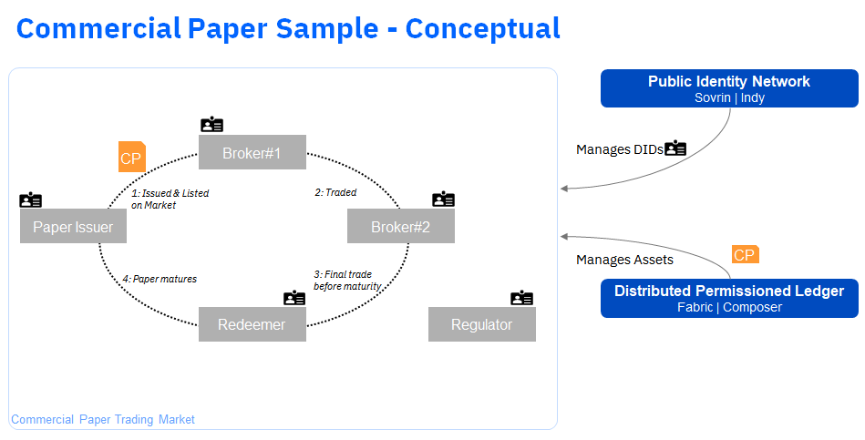

# Commerical Paper Sample - Starter Kit

This is a Commerical Paper scenario, built using Hyperleger Fabric & Hyperledger Composer. It is a full stack application repository
showing how a DLT can be used within a business scenario, along with other back and front-end applications. At the core is a Business Network that supports the trading of commerical paper.

The **Scenario** is that of Commerical Paper, here is [Wikipedia's definition](https://en.wikipedia.org/wiki/Commercial_paper)

> Commercial paper is a money-market security issued (sold) by large corporations to obtain funds to meet short-term debt obligations (for example, payroll), and is backed only by an issuing bank or company promise to pay the face amount on the maturity date specified on the note. 

---
## Are you an end user in wanting to trade in Commerical Paper? [Go Here](USAGE.md)
## Are you a developer wishing to extend or build upon this solution? [Go Here](DEVELOPMENT.md)
## Do you want to read more about the business network first? [Go Here](https://ampretia.github.io/commercial-paper-starter-kit/)
---

## More about this scenario

At the core of this scenario is a Business Network that defines the participants and assets within a Commcercial Paper trading situation. For full details of how this is structured please see the [network documentation](https://ampretia.github.io/commercial-paper-starter-kit/)

