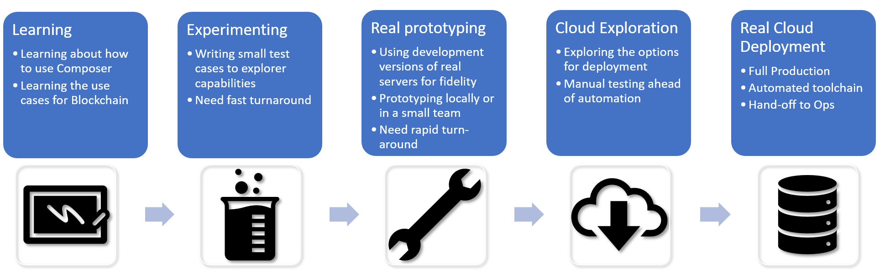

# Development Flow

This repo is designed to provide an example of using blockchain tech, within a larger full-stack application. Centred around the provision of a Commerical Paper trading scenario.



We're focussing on the "Real Prototyping", and "Cloud Exploration" and starting on the road to "Real Cloud Deployment".  

### End goals are

- See how "Real Prototyping" will work using the local develoment versions of the servers. And how you can roundtrip the development flow
- See how the skills and tools used will migrate to allow "Cloud Exploration" of the IBM Blockchain Starter Plan
- See how the scripts used to deploy all the components within this repo could be used as the basis for "Real Cloud Deployment"
- See the place for blockchain tech in a multi-tier application scenario

### What is not included

- There is no load-balancing or a/b deployment type techonolgies here.
- Everything in in this one repo - that is probably not how a real full tier-application would be stored. But it makes it possible to get an overview of the whole stack. 
- Kubernetes or similar type scripts for deployment.
- Extensive authorization and security - this would likely be a solution that might be deployed by different organizations with their own requirements

**Important:** Whilst the above things are not included, there is nothing within the design here that preculdes them.

## Architecture

Here is the logical structure of the technology components within this scenario.


## Layout of the repo

*Where is everything?*

```
├── apps                               # Applications directory
│   ├── commercial-paper-cli           # .. a pure cli app
│   ├── commerical-financing-webui     # .. webui app for paper creation - uses the REST API
│   ├── did-manager                    # .. webui for interacting with Hyperledger Indy
│   └── paper-trading-webui            # .. webui using websockets to the Composer Client

├── contracts                          # Smart contracts
│   └── commercial-paper-network      

├── docs                               # You're reading these docs now
│   └── apps

├── ledgers                            # Setup and config for Hyperledger Fabric and Indy
│   ├── hyperledger-fabric
│   └── identity

├── _localstore                        # Not part of the codebase but this is local file system card store
│   ├── cards                          # this can be moved if you wish. 
│   ├── client-data                    # Worth clearing out 
│   └── logs

├── services
│   ├── financing-rest                 # the rest API that is in use for some apps
│   

├── .bluemix                           # Scripts primarily used in a IBM Cloud Toolchain for Fabric deployment
└── .localtoolchain                    # scripts for local use, where the ones in .bluemix can't be reused

```

*Things to remember*

- Each application, service or ledger is independant in the sense that you may need to `npm install` them separately.
- There is a top level `guplfile.js` and a `DEMO.sh` script that can bring everything up together.
- But the aim is show you the various parts, and how each can be controlled and used. 
   - So for example the Ledger could be IBM Cloud, some applications on *cloud a* , the card store in *cloud g*, the other applications in *cloud ms* etc.


## Next steps

1. Get this scenario [running locally](./DEVELOPMENT-3.md)
2. Get the Smart Contracts [running in the cloud](./DEVELOPMENT-4.md)
3. Create a toolchain to [deploy in IBM Cloud](./DEVELOPMENT-5.md)
4. How does the [Smart Contract work and how it was designed?](./designing-the-smart-contract.md)

